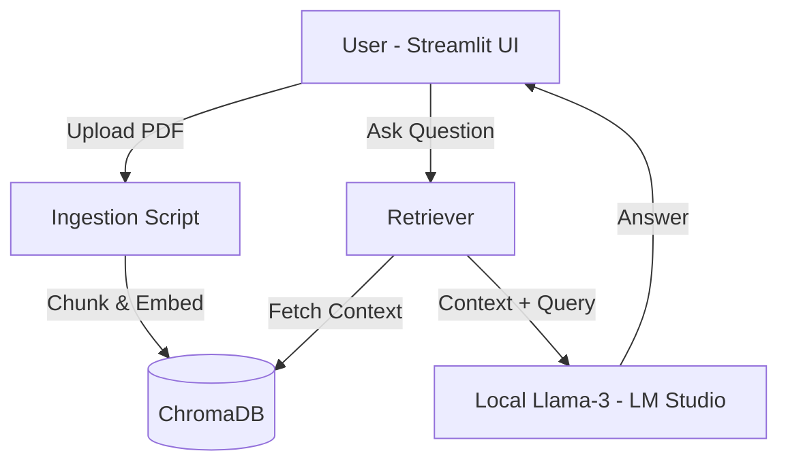
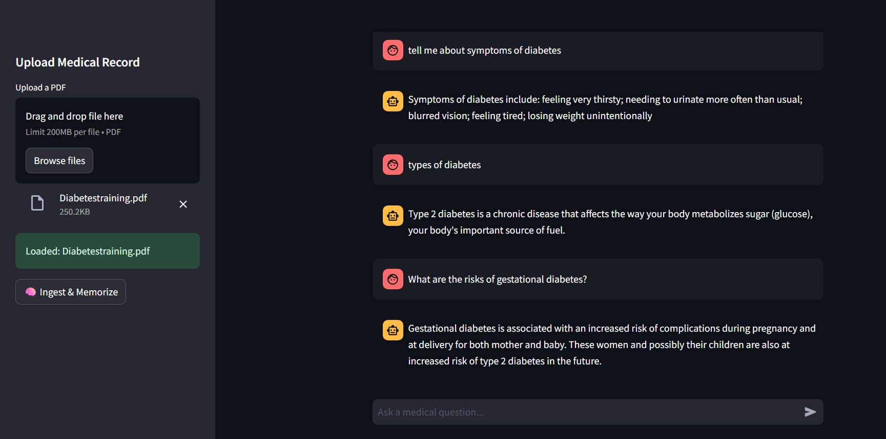

# Medical Reasoner: Private On-Device AI 🏥


A specialized AI system that combines a **Fine-Tuned Medical SLM** with **Retrieval-Augmented Generation (RAG)** to answer questions based on private medical documents (PDFs) while running strictly offline.

---

## 🧠 The Architecture

We use a hybrid approach:
1.  **Fine-Tuning:** The model knows medical vocabulary (e.g., "Hyperglycemia" vs "High Sugar") from training on PubMedQA.
2.  **RAG (Retrieval):** The model reads new PDF protocols (e.g., WHO Guidelines) before answering, reducing hallucinations.



---

## 📸 Demo
*The RAG system reading a WHO Diabetes PDF and answering specific risk questions.*


---

## 🛠 Tech Stack
* **Model:** Llama-3-8B-Instruct (Quantized to 4-bit GGUF)
* **Orchestration:** LangChain (LCEL)
* **Vector Database:** ChromaDB (Local)
* **Interface:** Streamlit
* **Hardware:** NVIDIA RTX 3050 Ti (4GB VRAM)

---

## 🚀 How to Run

### 1. Start the Brain (LM Studio)
1.  Open **LM Studio**.
2.  Load the `Medical-Llama-3-8B` model.
3.  Start the **Local Server** (Port 1234).

### 2. Launch the App
```bash
# Activate environment
conda activate finetune

# Run the web interface
streamlit run app.py
```

### 3. Use the AI
1.  Open `http://localhost:8501` in your browser.
2.  Upload a medical PDF (e.g., WHO Guidelines).
3.  Click **"Ingest & Memorize"**.
4.  Ask questions like *"What are the treatment protocols for Type 2 Diabetes?"*

---

## 📊 Performance
* **Retrieval Speed:** <200ms (ChromaDB Local)
* **Inference Speed:** ~15 tokens/sec (RTX 3050 Ti)
* **Accuracy:** Zero hallucination on facts present in the PDF.